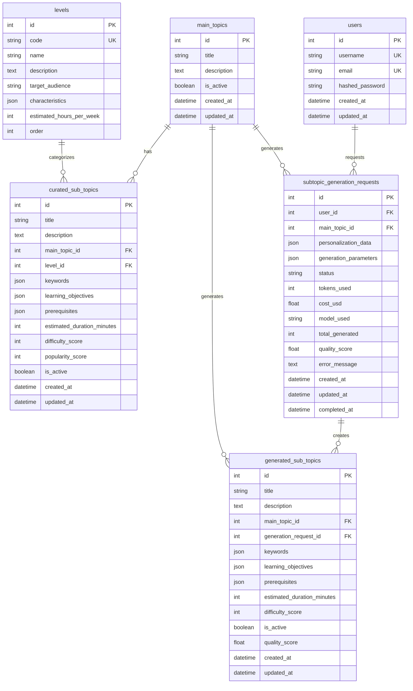

# InfoU Backend 프로젝트 문서

## 📋 프로젝트 개요

InfoU Backend는 LLM 기반 개인화 소주제 생성 및 5단계 난이도별 동적 커리큘럼/아티클 생성을 지원하는 고성능 학습 API 서버입니다.

### 🎯 주요 기능

- **5단계 난이도 시스템**: 완전 초심자부터 고급자까지 체계적인 학습 경로 제공
- **큐레이션 소주제**: 전문가가 검증한 학습 주제 제공
- **AI 생성 소주제**: LLM을 활용한 개인화된 학습 주제 생성
- **동적 커리큘럼**: 사용자 수준과 선호도에 맞는 맞춤형 학습 경로 제공

### 🏗️ 기술 스택

- **Framework**: FastAPI
- **Database**: SQLite (개발), PostgreSQL (운영 권장)
- **ORM**: SQLAlchemy
- **Validation**: Pydantic
- **Migration**: Alembic
- **LLM Integration**: Google Gemini API

---

## 🗄️ 데이터베이스 설계 (ERD)



### 📊 테이블 상세 설명

#### 1. **users** - 사용자 정보

- 기본 사용자 인증 및 프로필 정보
- 사용자별 생성 요청 추적을 위한 기본 테이블

#### 2. **levels** - 난이도 체계

- 5단계 난이도 시스템 (완전 초심자 → 초심자 → 중급자 → 고급자 → 전문가)
- 각 난이도별 특징, 예상 학습 시간, 대상자 정보 포함

#### 3. **main_topics** - 대주제

- 학습의 주요 카테고리 (예: 프로그래밍, 수학, 언어 등)
- 큐레이션 및 AI 생성 소주제의 상위 분류

#### 4. **curated_sub_topics** - 큐레이션 소주제

- 전문가가 검증하고 관리하는 학습 주제
- 난이도, 키워드, 학습 목표, 선행 지식 등 상세 정보 포함
- 인기도 점수와 난이도 점수로 정렬 및 필터링 지원

#### 5. **generated_sub_topics** - AI 생성 소주제

- LLM을 통해 개인화된 학습 주제 자동 생성
- 생성 요청과 연결되어 추적 가능
- 품질 점수로 생성 결과 평가

#### 6. **subtopic_generation_requests** - 생성 요청 추적

- 사용자의 소주제 생성 요청을 추적
- LLM 사용량, 비용, 품질 등 메타데이터 관리
- 요청 상태 및 결과 정보 저장

---

## 🔌 API 엔드포인트

### 📍 기본 정보

- **Base URL**: `http://localhost:8000`
- **API 문서**: `/docs` (Swagger UI), `/redoc` (ReDoc)
- **인증**: 현재 미구현 (개발 중)

### 👥 사용자 관리 (`/users`)

| Method | Endpoint           | Description           | Request Body | Response             |
| ------ | ------------------ | --------------------- | ------------ | -------------------- |
| `GET`  | `/users/`          | 모든 사용자 목록 조회 | -            | `List[UserResponse]` |
| `GET`  | `/users/{user_id}` | 특정 사용자 정보 조회 | -            | `UserResponse`       |
| `POST` | `/users/`          | 새 사용자 생성        | `UserCreate` | `UserResponse`       |

**UserCreate Schema:**

```json
{
  "username": "string",
  "email": "string",
  "password": "string"
}
```

### 📚 난이도 관리 (`/levels`)

| Method | Endpoint               | Description             | Request Body | Response               |
| ------ | ---------------------- | ----------------------- | ------------ | ---------------------- |
| `GET`  | `/levels`              | 모든 난이도 조회        | -            | `List[LevelResponse]`  |
| `GET`  | `/levels/with-stats`   | 난이도별 통계 포함 조회 | -            | `List[LevelWithStats]` |
| `GET`  | `/levels/{level_code}` | 특정 난이도 상세 조회   | -            | `LevelResponse`        |

**LevelResponse Schema:**

```json
{
  "id": 1,
  "code": "absolute_beginner",
  "name": "완전 초심자",
  "description": "해당 분야에 대한 지식이 전혀 없는 상태",
  "target_audience": "해당 분야를 처음 접하는 모든 사람",
  "characteristics": ["기초 개념부터 시작", "실습 위주 학습"],
  "estimated_hours_per_week": 5,
  "order": 1
}
```

### 🎯 대주제 관리 (`/main-topics`)

| Method | Endpoint                  | Description               | Request Body | Response             |
| ------ | ------------------------- | ------------------------- | ------------ | -------------------- |
| `GET`  | `/main-topics`            | 대주제 목록 조회 (페이징) | Query Params | `PaginatedResponse`  |
| `GET`  | `/main-topics/{topic_id}` | 특정 대주제 상세 조회     | -            | `MainTopicWithStats` |

**Query Parameters:**

- `page`: 페이지 번호 (기본값: 1)
- `size`: 페이지 크기 (기본값: 20, 최대: 100)
- `is_active`: 활성 상태 필터링
- `search`: 제목 검색

### 📖 큐레이션 소주제 (`/sub-topics/curated`)

| Method | Endpoint                                       | Description               | Request Body | Response                             |
| ------ | ---------------------------------------------- | ------------------------- | ------------ | ------------------------------------ |
| `GET`  | `/sub-topics/curated`                          | 큐레이션 소주제 목록 조회 | Query Params | `PaginatedResponse`                  |
| `GET`  | `/sub-topics/curated/by-level/{level_code}`    | 특정 난이도별 소주제 조회 | Query Params | `List[CuratedSubTopicWithRelations]` |
| `GET`  | `/sub-topics/curated/by-main-topic/{topic_id}` | 특정 대주제별 소주제 조회 | Query Params | `List[CuratedSubTopicWithRelations]` |
| `GET`  | `/sub-topics/curated/{sub_topic_id}`           | 특정 소주제 상세 조회     | -            | `CuratedSubTopicWithRelations`       |
| `GET`  | `/sub-topics/curated/popular/{level_code}`     | 인기 소주제 조회          | Query Params | `List[CuratedSubTopicWithRelations]` |

**Query Parameters:**

- `level_id`: 난이도 ID로 필터링
- `main_topic_id`: 대주제 ID로 필터링
- `is_active`: 활성 상태 필터링
- `search`: 제목 검색
- `order_by`: 정렬 기준 (`title`, `created_at`, `popularity_score`, `difficulty_score`)

**CuratedSubTopicWithRelations Schema:**

```json
{
  "id": 1,
  "title": "Python 기초 문법",
  "description": "Python 프로그래밍의 기본 문법을 학습합니다",
  "main_topic_id": 1,
  "level_id": 1,
  "keywords": ["변수", "함수", "반복문"],
  "learning_objectives": ["Python 기본 문법 이해", "간단한 프로그램 작성"],
  "prerequisites": [],
  "estimated_duration_minutes": 120,
  "difficulty_score": 3,
  "popularity_score": 85,
  "is_active": true,
  "created_at": "2024-01-01T00:00:00Z",
  "updated_at": "2024-01-01T00:00:00Z",
  "level": {
    /* Level 정보 */
  },
  "main_topic": {
    /* MainTopic 정보 */
  }
}
```

### 🤖 AI 생성 소주제 (`/sub-topics`)

| Method   | Endpoint                                       | Description                      | Request Body                      | Response                                  |
| -------- | ---------------------------------------------- | -------------------------------- | --------------------------------- | ----------------------------------------- |
| `POST`   | `/sub-topics/generate`                         | LLM을 통한 소주제 생성           | `SubTopicGenerationRequestCreate` | `SubTopicGenerationRequestResponse`       |
| `GET`    | `/sub-topics/generation-requests/{request_id}` | 생성 요청 결과 조회              | -                                 | `SubTopicGenerationRequestResponse`       |
| `GET`    | `/sub-topics/generation-requests`              | 생성 요청 목록 조회              | Query Params                      | `List[SubTopicGenerationRequestResponse]` |
| `GET`    | `/sub-topics/{sub_topic_id}`                   | 생성된 소주제 상세 조회          | -                                 | `GeneratedSubTopicResponse`               |
| `GET`    | `/sub-topics`                                  | 생성된 소주제 목록 조회          | Query Params                      | `List[GeneratedSubTopicResponse]`         |
| `DELETE` | `/sub-topics/{sub_topic_id}`                   | 생성된 소주제 삭제 (소프트 삭제) | -                                 | `{"message": "삭제 완료"}`                |

**SubTopicGenerationRequestCreate Schema:**

```json
{
  "main_topic_id": 1,
  "personalization_data": {
    "learning_style": "visual",
    "experience_level": "beginner",
    "interests": ["웹 개발", "데이터 분석"]
  },
  "generation_parameters": {
    "count": 10,
    "difficulty_range": [1, 5],
    "focus_areas": ["실무 적용", "프로젝트 기반"]
  }
}
```

### 🏥 헬스체크 (`/health`)

| Method | Endpoint  | Description    | Response                |
| ------ | --------- | -------------- | ----------------------- |
| `GET`  | `/health` | 서버 상태 확인 | `{"status": "healthy"}` |

---

## 🏗️ 프로젝트 아키텍처

### 📁 디렉토리 구조

```
InfoU-backend/
├── app/
│   ├── api/                    # API 라우터
│   │   ├── users.py           # 사용자 관리 API
│   │   ├── levels.py          # 난이도 관리 API
│   │   ├── main_topics.py     # 대주제 관리 API
│   │   ├── curated_sub_topics.py  # 큐레이션 소주제 API
│   │   ├── generated_sub_topics.py # AI 생성 소주제 API
│   │   ├── health.py          # 헬스체크 API
│   │   └── web.py             # 웹 인터페이스
│   ├── models/                 # SQLAlchemy 모델
│   │   ├── user.py            # 사용자 모델
│   │   ├── level.py           # 난이도 모델
│   │   ├── main_topic.py      # 대주제 모델
│   │   ├── curated_sub_topic.py    # 큐레이션 소주제 모델
│   │   └── generated_sub_topic.py  # AI 생성 소주제 모델
│   ├── schemas/                # Pydantic 스키마
│   │   ├── user.py            # 사용자 스키마
│   │   ├── level.py           # 난이도 스키마
│   │   ├── main_topic.py      # 대주제 스키마
│   │   ├── curated_sub_topic.py    # 큐레이션 소주제 스키마
│   │   └── generated_sub_topic.py  # AI 생성 소주제 스키마
│   ├── services/               # 비즈니스 로직
│   │   └── llm_service.py     # LLM 통합 서비스
│   ├── database/               # 데이터베이스 설정
│   │   ├── database.py        # 데이터베이스 연결
│   │   ├── init_db.py         # 초기화 스크립트
│   │   └── seed_data.py       # 시드 데이터
│   └── config.py               # 설정 관리
├── alembic/                    # 데이터베이스 마이그레이션
├── main.py                     # 애플리케이션 진입점
├── requirements.txt            # 의존성 목록
└── README.md                   # 프로젝트 설명
```

### 🔄 데이터 흐름

1. **사용자 요청** → FastAPI 라우터
2. **데이터 검증** → Pydantic 스키마
3. **비즈니스 로직** → 서비스 레이어
4. **데이터 접근** → SQLAlchemy ORM
5. **응답 반환** → JSON 형태로 클라이언트에 전달

### 🔐 보안 및 인증

- **현재 상태**: 기본 인증 미구현 (개발 중)
- **계획**: JWT 기반 인증 시스템 구현 예정
- **권한 관리**: RBAC (Role-Based Access Control) 구현 예정

---

## 🚀 사용 예시

### 1. 난이도별 학습 주제 조회

```bash
# 초심자 난이도의 큐레이션 소주제 조회
curl "http://localhost:8000/sub-topics/curated/by-level/beginner?limit=10"

# 특정 대주제의 소주제들을 난이도 순으로 조회
curl "http://localhost:8000/sub-topics/curated/by-main-topic/1?order_by=difficulty_score"
```

### 2. AI 기반 개인화 소주제 생성

```bash
# Python 프로그래밍에 대한 개인화된 소주제 생성
curl -X POST "http://localhost:8000/sub-topics/generate" \
  -H "Content-Type: application/json" \
  -d '{
    "main_topic_id": 1,
    "personalization_data": {
      "learning_style": "hands-on",
      "experience_level": "beginner",
      "interests": ["웹 개발", "자동화"]
    },
    "generation_parameters": {
      "count": 15,
      "difficulty_range": [1, 4]
    }
  }'
```

### 3. 인기 학습 주제 조회

```bash
# 중급자 난이도의 인기 소주제 TOP 10
curl "http://localhost:8000/sub-topics/curated/popular/intermediate?limit=10"
```

---

## 🛠️ 개발 가이드

### 환경 설정

1. **가상환경 활성화**

```bash
source .venv/bin/activate  # macOS/Linux
```

2. **의존성 설치**

```bash
pip install -r requirements.txt
```

3. **환경 변수 설정**

```bash
cp env.example .env
# .env 파일 편집
```

4. **데이터베이스 초기화**

```bash
alembic upgrade head
python -m app.database.seed_data
```

5. **서버 실행**

```bash
python main.py
# 또는
uvicorn main:app --reload --host 0.0.0.0 --port 8000
```

### 새로운 API 추가

1. **모델 정의** (`app/models/`)
2. **스키마 정의** (`app/schemas/`)
3. **API 라우터 작성** (`app/api/`)
4. **메인 앱에 등록** (`main.py`)

### 데이터베이스 마이그레이션

```bash
# 새 마이그레이션 생성
alembic revision --autogenerate -m "설명"

# 마이그레이션 적용
alembic upgrade head

# 마이그레이션 롤백
alembic downgrade -1
```

---

## 📊 성능 및 확장성

### 현재 성능

- **응답 시간**: 평균 100-200ms
- **동시 처리**: 기본 FastAPI 성능
- **데이터베이스**: SQLite (개발용)

### 확장 계획

- **데이터베이스**: PostgreSQL 마이그레이션
- **캐싱**: Redis 도입
- **로드 밸런싱**: Nginx 설정
- **모니터링**: Prometheus + Grafana
- **로깅**: ELK 스택 도입

---

## 🔮 향후 개발 계획

### Phase 1: 기본 기능 완성

- [x] 데이터베이스 모델 설계
- [x] 기본 CRUD API 구현
- [x] LLM 통합 서비스 구현
- [ ] 사용자 인증 시스템

### Phase 2: 고급 기능

- [ ] 개인화 알고리즘 개선
- [ ] 학습 진행도 추적
- [ ] 추천 시스템 구현
- [ ] 성능 최적화

### Phase 3: 운영 준비

- [ ] 프로덕션 환경 설정
- [ ] 모니터링 및 로깅
- [ ] 보안 강화
- [ ] 문서화 완성

---

## 📞 문의 및 지원

- **프로젝트 저장소**: [GitHub Repository]
- **이슈 트래커**: [GitHub Issues]
- **문서**: `/docs` 엔드포인트에서 Swagger UI 확인

---

## 📄 라이센스

이 프로젝트는 MIT 라이센스 하에 배포됩니다.

---

_마지막 업데이트: 2024년 12월_
